# Как добавить библиотеку kotlinx.serialization.json в intellijIDEA

Изначально можно столкнуться с такой проблемой:
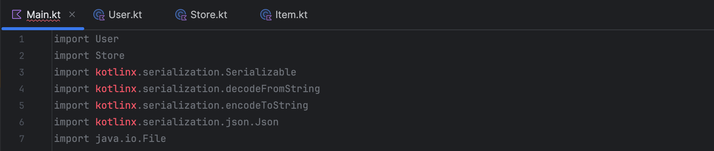
Чтобы ее решить вот пошаговый гайд:
## Шаг 1
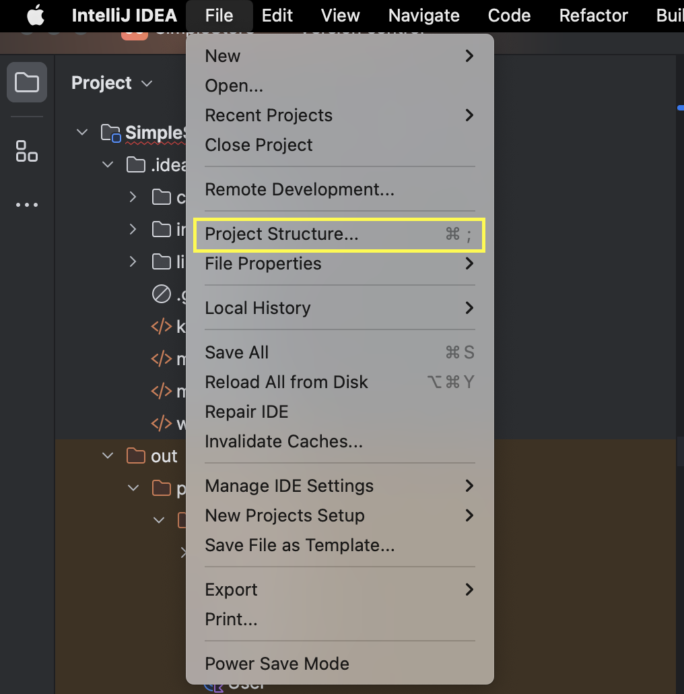
Нажать на file и открыть project structure
## Шаг 2
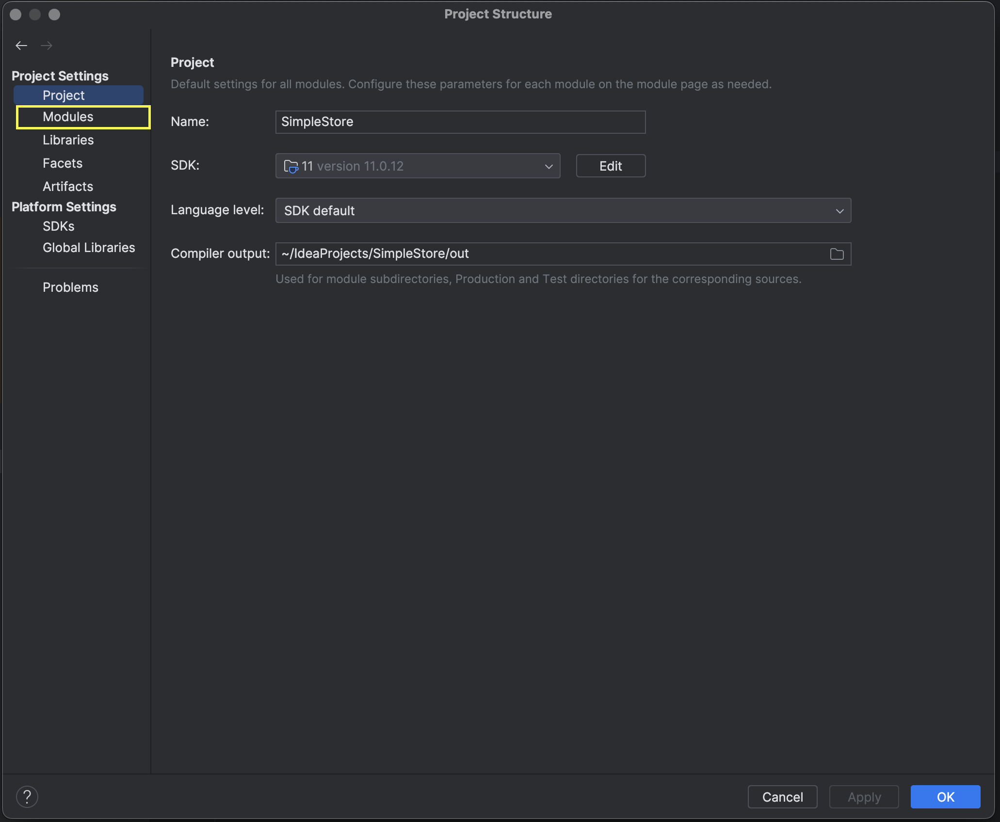
Перейти на вкладку Modules
## Шаг 3
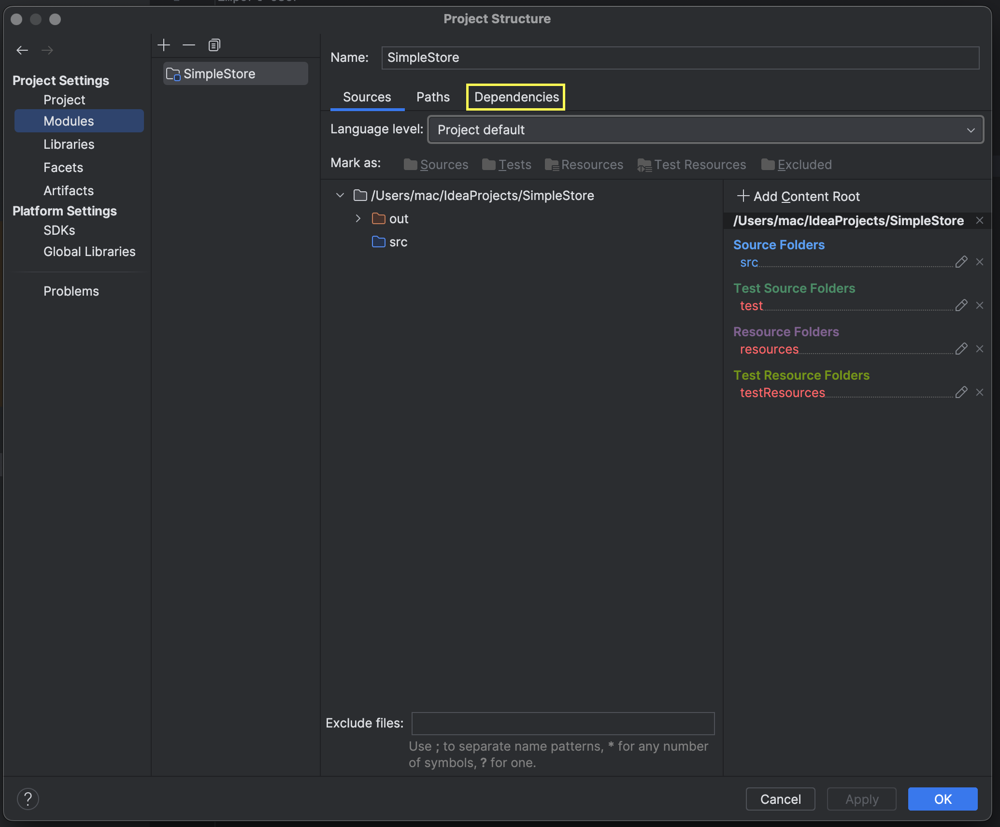
Далее на вкладку Dependencies
## Шаг 4
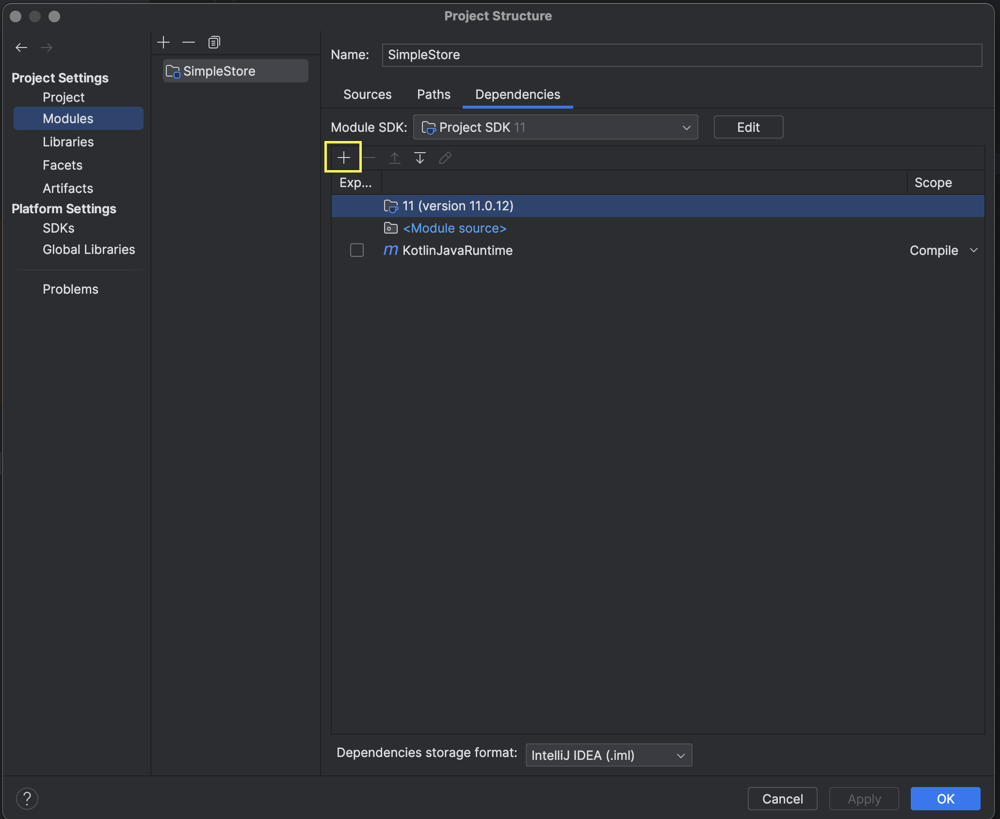
Нажать на "+"
## Шаг 5
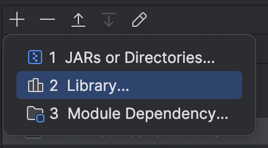

Далее Library
## Шаг 6
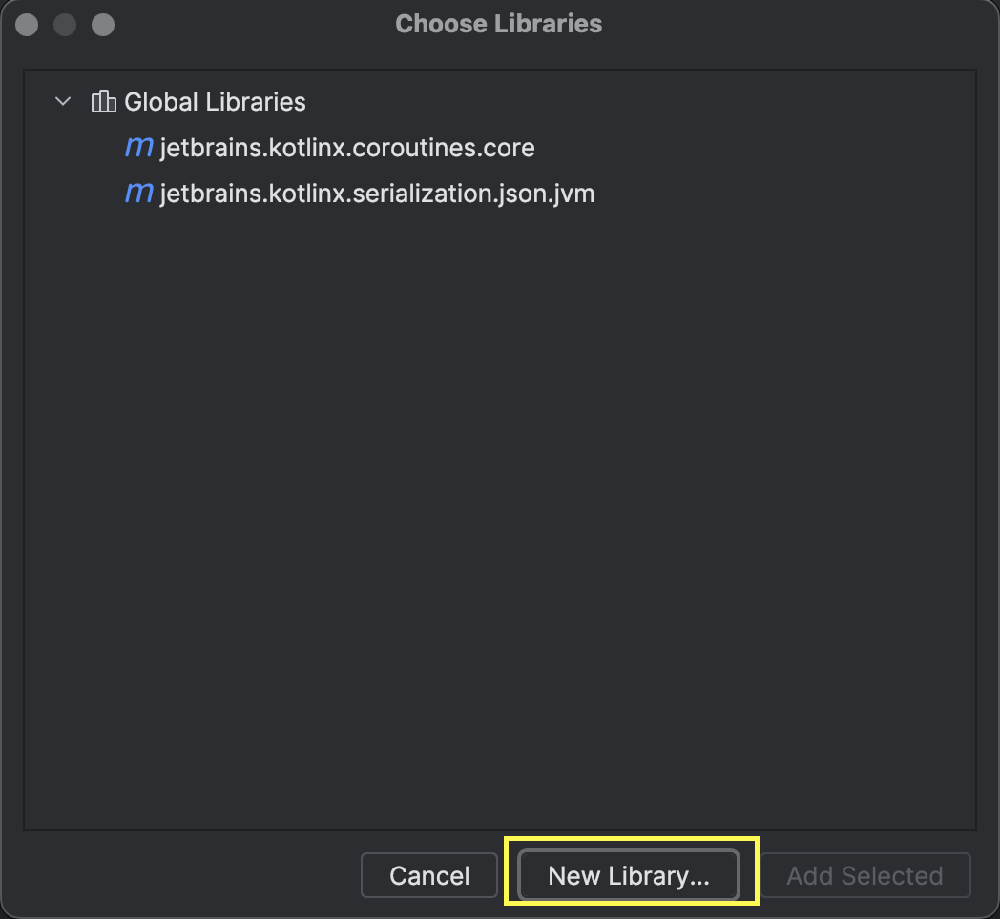

Затем New Library
## Шаг 7
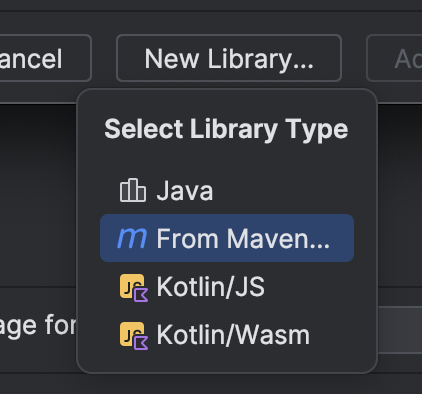

Затем From Maven
## Шаг 8
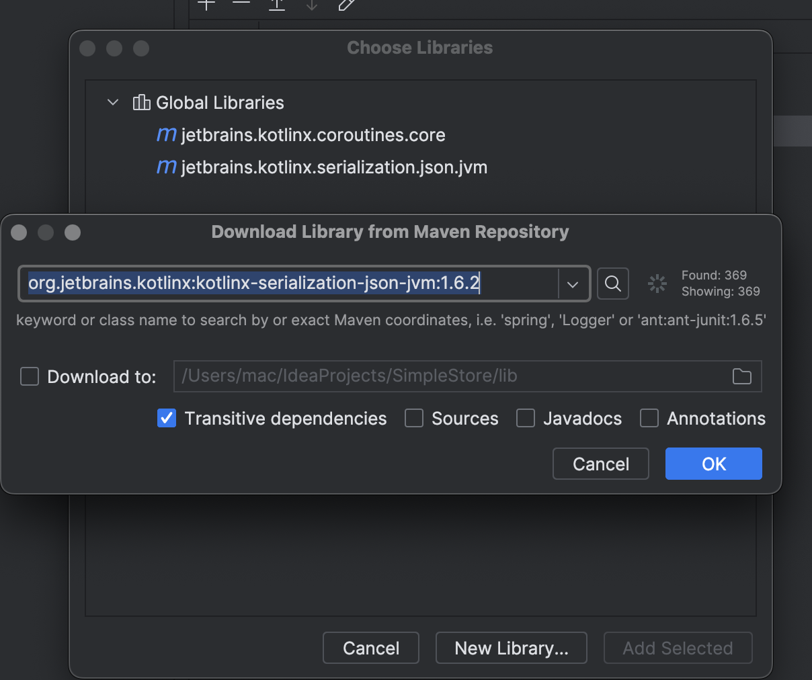
Затем ввести в поле следующий текст: org.jetbrains.kotlinx:kotlinx-serialization-json-jvm:1.6.2
## Шаг 9

Нажать "OK"
## Шаг 10
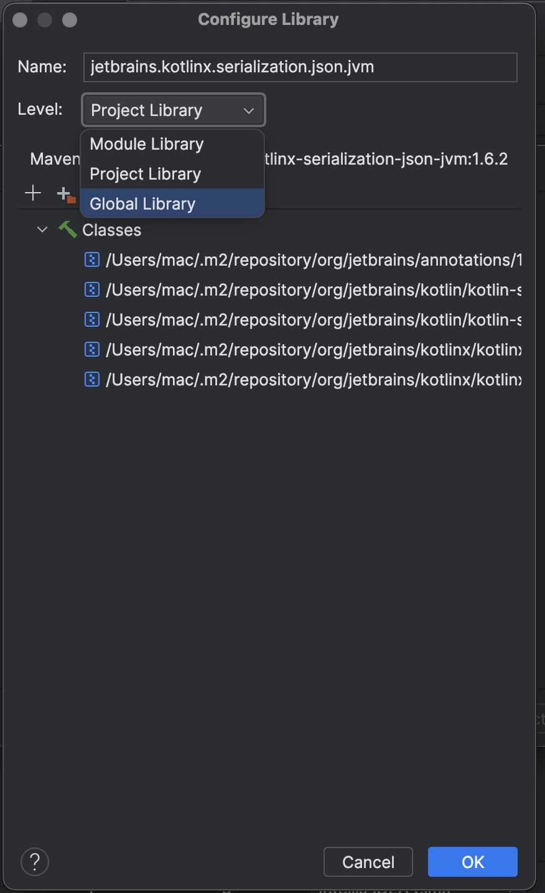
На вкладке Level выбрать Global Library, чтобы библиотеку было проще добавлять в другие проекты
## Шаг 11
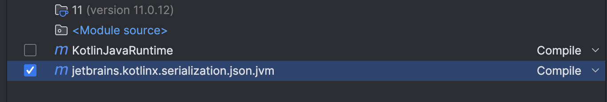
Поставить галочку в чекбоксе напротив новой добавленной зависимости
## Шаг 12

Нажать Apply, Затем OK
## Шаг 13
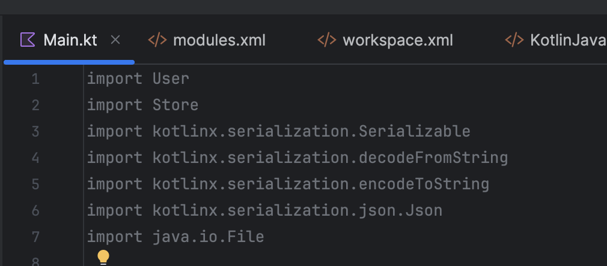
Радоваться!
